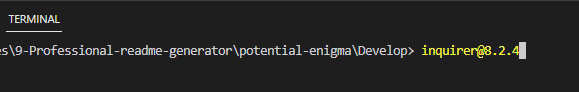
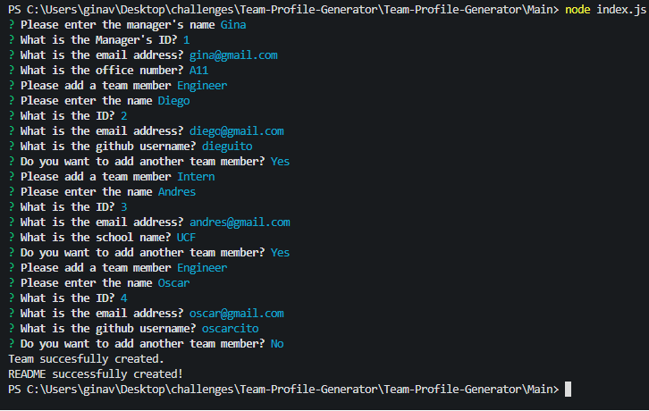

# Team-Profile-Generator

# Description

This app accepts user input and requests the user to enter the information of team members, starting with the manager information, then the the app gives you the option to either enter an engineer, or an intern, or to finish building the team. When the user selects the engineer option, then the app prompts the user to answer questions for the engineer and when done the app takes the user to the main menu. When selecting the intern option, the app requests the user to enter specific questions about the intern and when done, it takes the user back to the main menu. When the user decides to finish entering the team members and exits the application, a HTML is generated with all the information entered. I was challenged to review and practice all the subjects I have learned through the bootcamp. Some of the last lessons have been hard to understand, and I have been able to get a better grasp of the OOP concept while working on this application.

# Table of Contents

- [Installation](#installation)
- [Usage](#usage)
- [Credits](#credits)
- [Contributing](#contributing)
- [Tests](#tests)
- [Questions](#questions)
- [License](#license)

# Installation
After opening the terminal, it is necessary to install npm init -y, then the inquirer package, npm inquirer@8.2.4.

# Usage

After going to the terminal and typing node index.js, the application will start displaying a series of prompts to build a team, starting with the manager information, then there will be options to add an engineer and an intern. After answering all the questions and exiting the application in the terminal, an HTML will be generated.

Link to the walkthrough video that demonstrates the functionality of the README generator [Click here to watch the video](https://drive.google.com/file/d/1zGuKZzuoalbatS5zntjUP5z35saLKSWd/view)

# Credits
- 
- 

# Contributing
Please reach out to me if you would like to contribute to this project.

# Tests
I will be testing this app using the terminal.

# Questions
Link to my github profile [Github](https://github.com/ginitadavis/)
If you have any questions, you can reach me via email at gina.vera.davis@gmail.com

# License

            
            MIT License

Copyright (c) 2013 Mark Otto.
Copyright (c) 2017 Andrew Fong.
Permission is hereby granted, free of charge, to any person obtaining a copy of this software and associated documentation files (the "Software"), to deal in the Software without restriction, including without limitation the rights to use, copy, modify, merge, publish, distribute, sublicense, and/or sell copies of the Software, and to permit persons to whom the Software is furnished to do so, subject to the following conditions:
The above copyright notice and this permission notice shall be included in all copies or substantial portions of the Software.
THE SOFTWARE IS PROVIDED "AS IS", WITHOUT WARRANTY OF ANY KIND, EXPRESS OR IMPLIED, INCLUDING BUT NOT LIMITED TO THE WARRANTIES OF MERCHANTABILITY, FITNESS FOR A PARTICULAR PURPOSE AND NONINFRINGEMENT. IN NO EVENT SHALL THE AUTHORS OR COPYRIGHT HOLDERS BE LIABLE FOR ANY CLAIM, DAMAGES OR OTHER LIABILITY, WHETHER IN AN ACTION OF CONTRACT, TORT OR OTHERWISE, ARISING FROM, OUT OF OR IN CONNECTION WITH THE SOFTWARE OR THE USE OR OTHER DEALINGS IN THE SOFTWARE.

    